# Untrackd
### GPS Activity Tracking for Skiers, Hikers & Cyclists

> **Status:** Completed — pending App Store release

> 📱 **[Try it on TestFlight](https://testflight.apple.com/join/JWNQrnyx)**

> 🌐 **[Visit the Website](https://www.untrackdapp.com)**

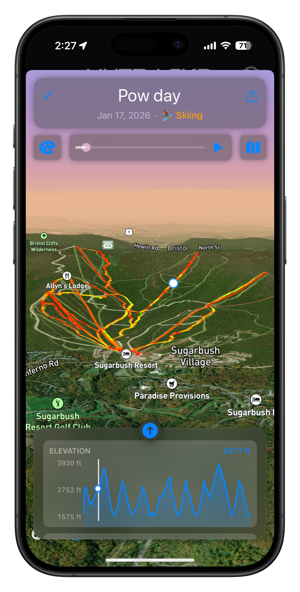

---

## Overview

Untrackd is a native iOS app built for outdoor athletes who want more than a step counter. It records GPS tracks with high fidelity, calculates detailed performance stats, and gives you a rich set of tools to explore, share, and plan your time outdoors — whether you're on skis, trails, or a bike.

Built entirely solo in Swift/SwiftUI, from GPS engine to social layer.

---

## Features

### 📍 GPS Track Recording
Real-time activity tracking with a custom GPS filtering pipeline that eliminates glitch spikes — no more 100 mph readings from a bad satellite fix. Calculates max speed, vertical gain/loss, distance, and time on the fly.

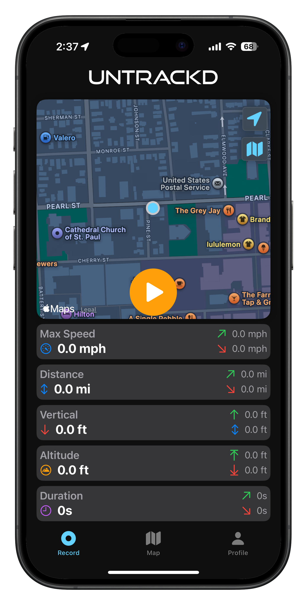

---

### 📊 Detailed Stats & History
Per-track stats are cached locally and synced to Firebase. Lifetime stats aggregate across every session you've ever recorded — top speed, total vertical, best days, streaks, and more. Tappable stat cards drill into dedicated detail views.

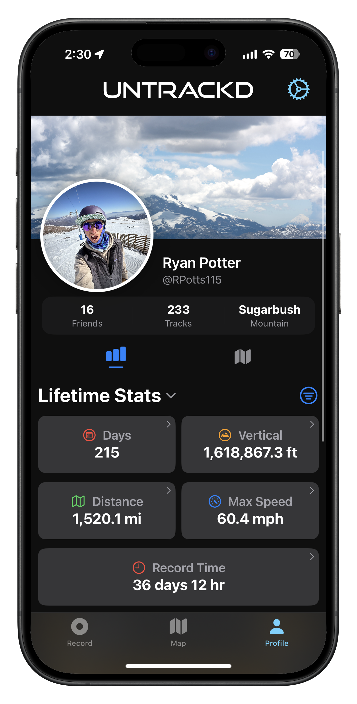 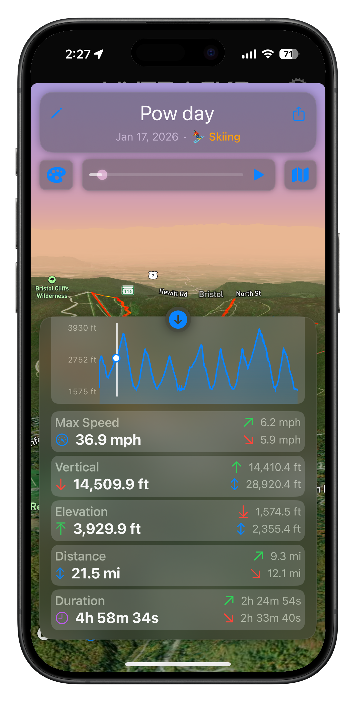

---

### 🗺️ 3D Interactive Map with Route Builder
A Mapbox-powered 3D map lets you visualize saved routes as colored overlays with elevation profiles. Tap any route to open an inspector with a scrub bar, stats grid, and color picker. Build new routes by panning the map and dropping waypoints with a crosshair — no tap-target fighting.

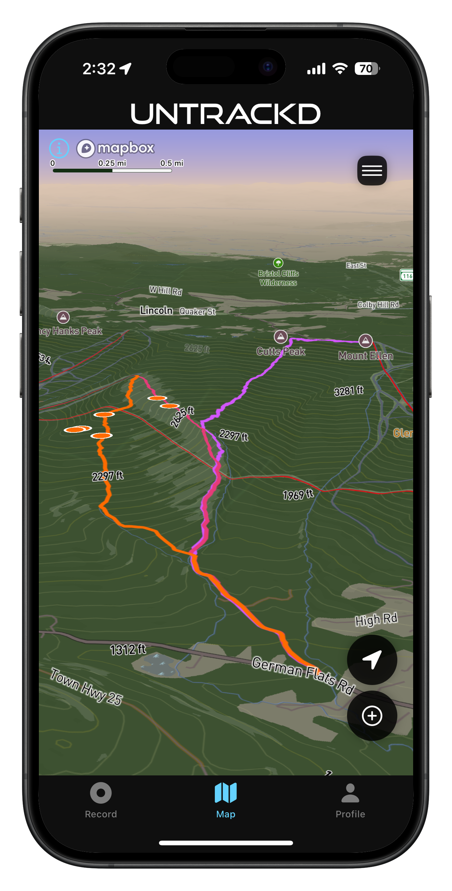

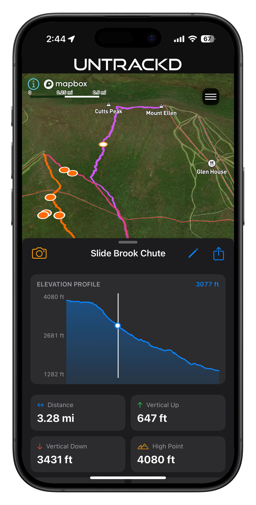 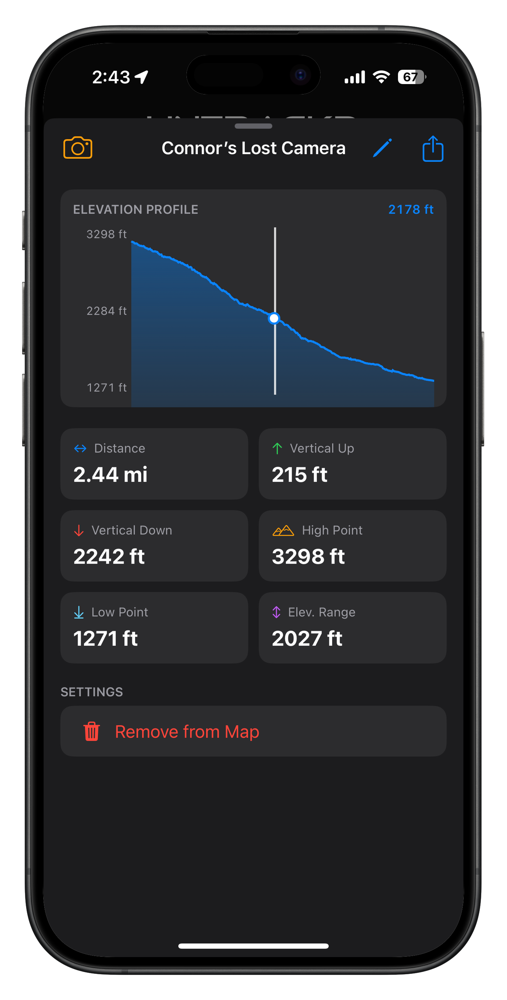

---

### 🎬 Track Playback & Visualization
Recorded tracks play back as animated overlays with four color modes: Normal, Speed gradient, Activity type, and Uphill/Downhill. A scrub bar lets you move through the track frame by frame. Chairlift segments are detected automatically.

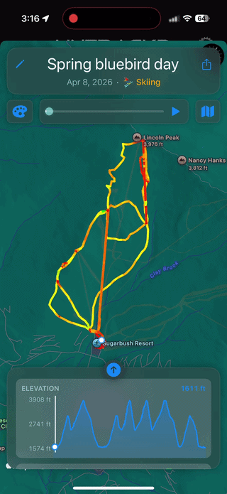 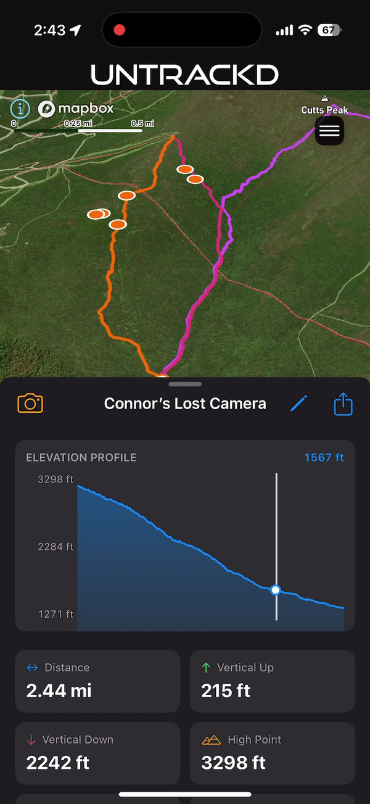

---

### 🗺️ Terrain Overlays
Visualize slope angle, aspect, and live weather radar directly on the 3D map to plan routes and assess conditions before you go.

 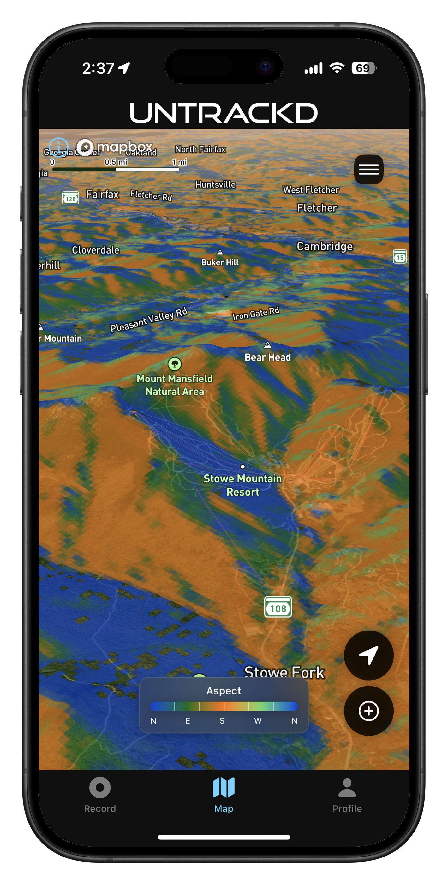 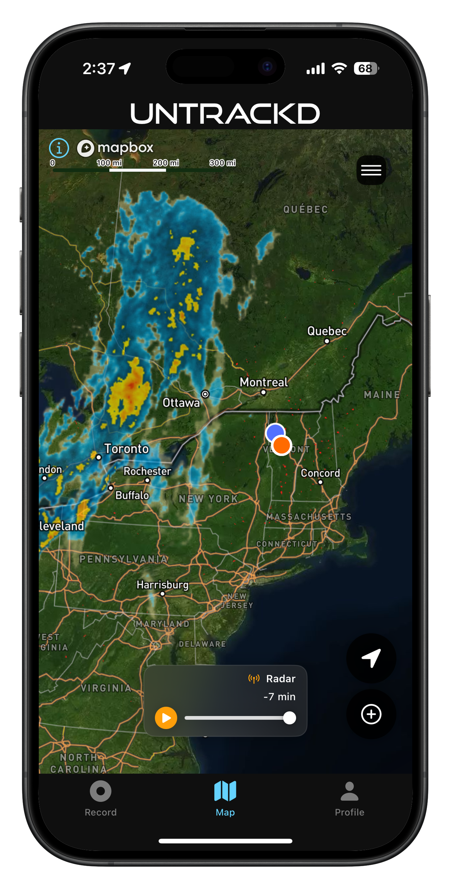

---

### ✏️ Track Editing
Trim and adjust recorded tracks with a timeline editor. Set activity type, adjust start and end points, and add segments directly to the 3D map.

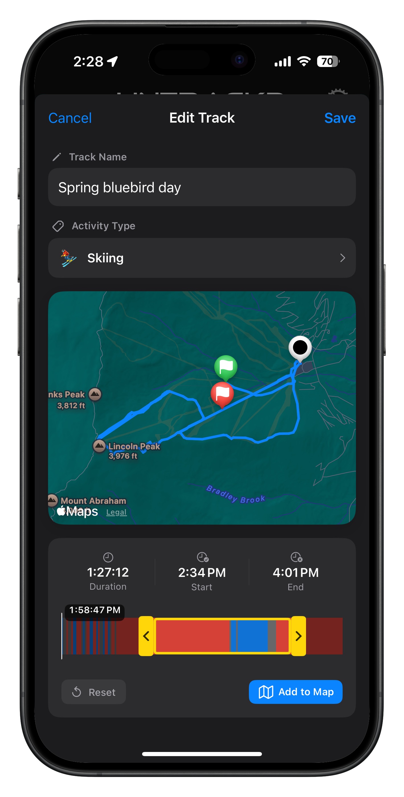

---

### 📤 Track Export
Export your tracks as shareable cards — either a map snapshot with stats overlaid, or a full photo background with a draggable track sticker. Supports Instagram-compatible canvas sizes.

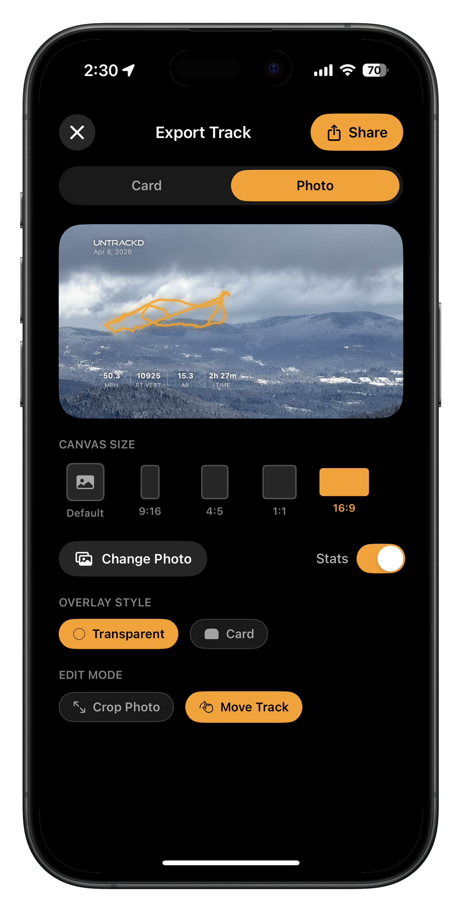 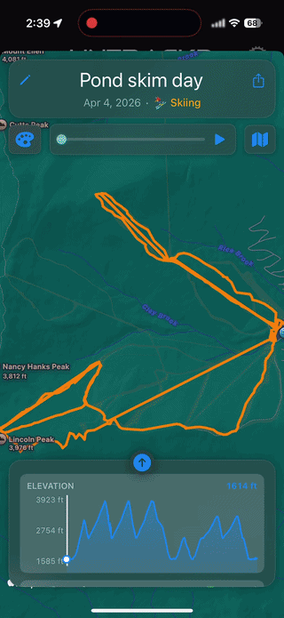

---

### 🥽 AR Track Viewer *(Experimental)*
View a saved route overlaid on the real world through your camera using ARKit. GPS coordinates are converted to local ENU space and rendered as a 3D tube on the ground, anchored to your real-world position — like a Waze overlay for the trail ahead.

---

### 👥 Social Layer
Follow friends, view their tracks and stats, and compare performances. Friend profiles load from Firebase with full stat breakdowns. Activity types (ski, hike, bike) tag each track and filter into season breakdowns.

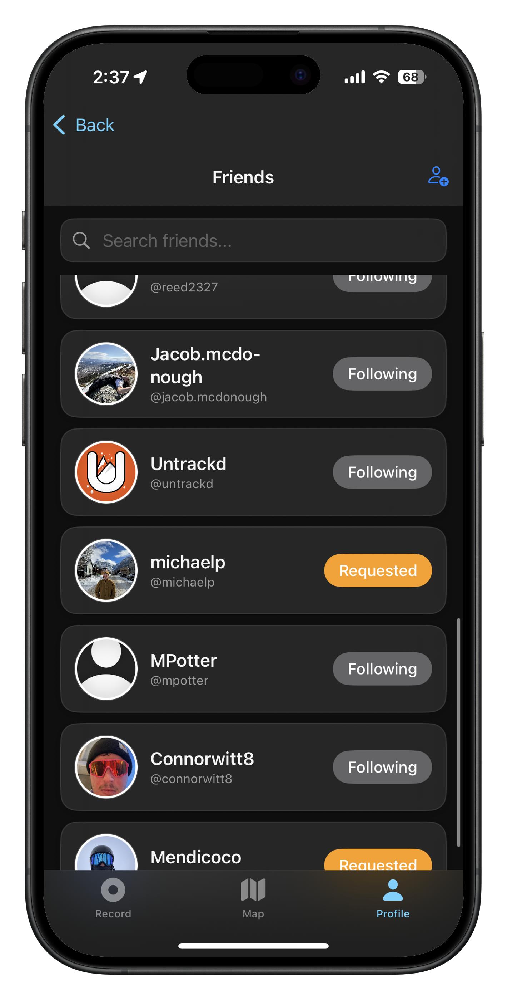 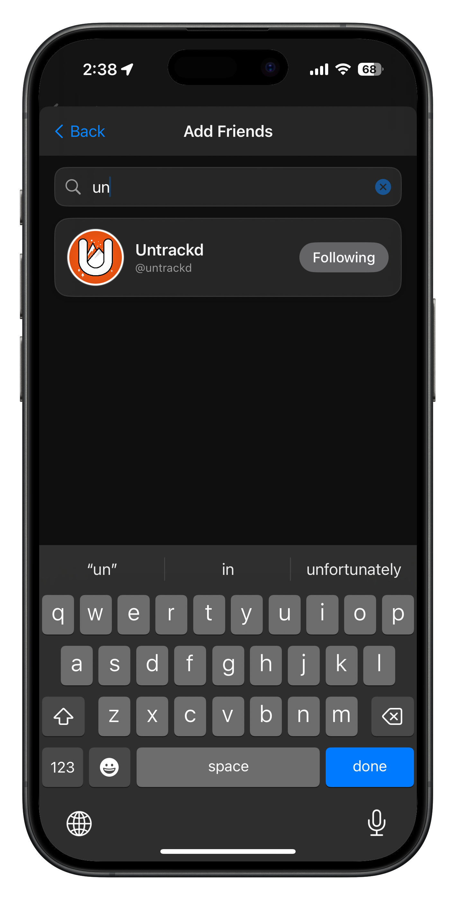 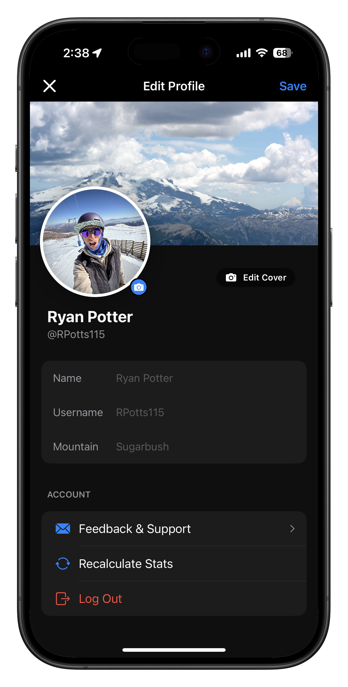

---

## Tech Stack

| Layer | Technology |
|---|---|
| Language | Swift 5.9 |
| UI Framework | SwiftUI |
| Maps | Mapbox Maps SDK v11 |
| Charts | Swift Charts |
| AR | ARKit + SceneKit |
| Backend | Firebase (Auth, Firestore) |
| GPS Processing | Custom filtering pipeline |
| Dependency Management | CocoaPods |
| Distribution | TestFlight → App Store (pending) |

---

## Architecture Highlights

- **Stats Cache** — Per-track and lifetime stats are cached locally in a typed `Codable` struct system, independent of Firebase. Cache rebuilds without wiping activity assignments. Syncs to Firebase on update via `NotificationCenter`.
- **GPS Glitch Filtering** — A 7-point sliding window compares speed to/from each candidate point against the surrounding context. Spikes that aren't corroborated by neighboring points are removed before stats are calculated.
- **Chairlift Detection** — Segments are classified as lifts using a path straightness score over a sliding window, making it robust to gondolas and terrain-variable lifts where elevation alone fails.
- **AR Track Navigation** - Saved routes render as 3D tubes in ARKit using `.gravityAndHeading` world alignment. GPS coordinates are converted to local ENU (East-North-Up) space via WGS84 projection, anchoring the virtual path to the user's real-world position. The scene rebuilds dynamically as the user moves.
- **Mapbox Architecture** — The map fills the full ZStack as a base layer with UI overlaid on top. Invisible tap layers use `lineOpacity: 0.001` (not `UIColor.clear`) for reliable hit detection. Route previews update via `updateGeoJSONSource` on a `CircleLayer`-backed source to avoid flickering.
- **Export Rendering** — Canvas is rendered at preview dimensions and scaled up, keeping sticker positions and crop alignment correct across all export size presets.

---

## Project Status

The app is feature-complete and currently in TestFlight. App Store release is pending LLC formation.

> 📱 **[Try it on TestFlight](https://testflight.apple.com/join/JWNQrnyx)**

> 🌐 **[Visit the Website](https://www.untrackdapp.com)**

This repository is intentionally partial — core business logic and the full source are kept private. This repo is a curated window into the architecture and feature set.

---

## Contact

Ryan Potter · [ryanjpotter1@gmail.com](mailto:ryanjpotter1@gmail.com)
